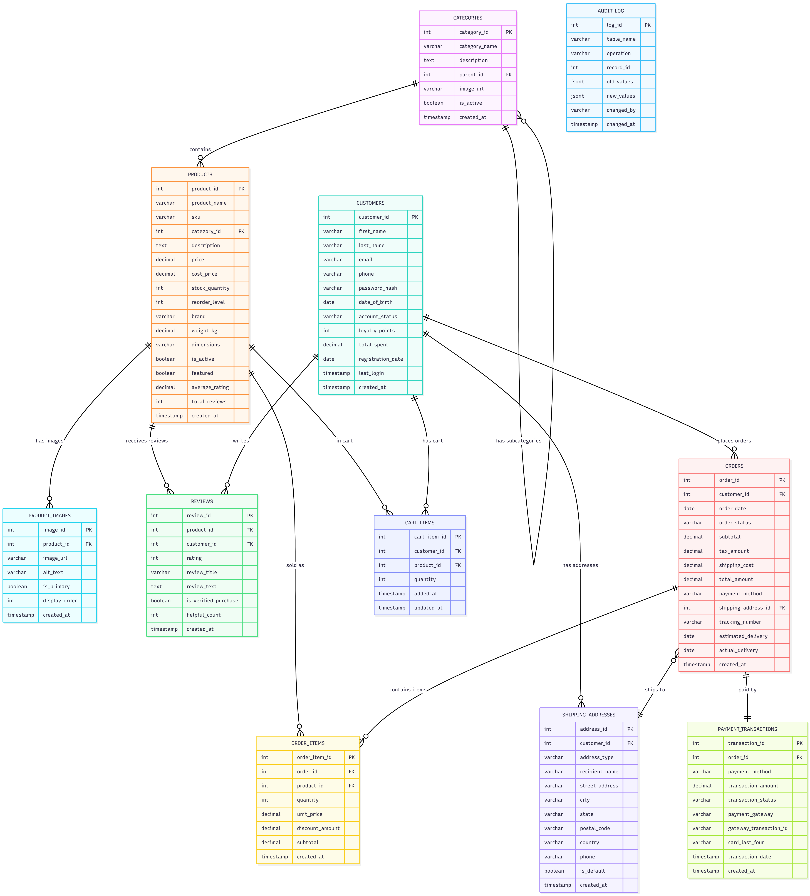

# 🛒 E-Commerce Platform Database System

**Student:** Sajid  
**Course:** Database Management Systems  
**Project Track:** Option 3 - Advanced DBA / DevOps Implementation  
**Database Engine:** PostgreSQL 13+ / Supabase  
**Last Updated:** October 2025

---

## 📋 Executive Summary

A comprehensive, production-ready PostgreSQL database system designed for modern online retail operations. This project implements a complete e-commerce backend supporting product catalog management, customer accounts, shopping cart functionality, order processing, payment integration, and customer reviews - all with enterprise-grade security, automated business logic, and real-time analytics.

**Project Scale:** 11 normalized tables, 339 curated records, 8 automated triggers, 5 analytical views, 25+ security policies, and dual deployment options (local PostgreSQL and Supabase cloud).

**Business Domain:** Digital retail platform serving electronics, fashion, home goods, sports equipment, books, and health/beauty products across Boston-area customers.

---

## 🗂️ Entity-Relationship Diagram



### Database Architecture

The data model implements a complete retail ecosystem:

- **Product Catalog:** Hierarchical categories (Electronics → Computers, Fashion → Men's/Women's) with rich product details, multiple images, and inventory tracking
- **Customer Management:** Account profiles with loyalty points, order history, and multiple shipping addresses
- **Shopping Experience:** Persistent shopping carts for authenticated users
- **Order Fulfillment:** Complete order lifecycle (Processing → Shipped → Delivered) with line-item details and tracking numbers
- **Payment Processing:** Secure transaction records with Stripe/PayPal integration (last 4 digits only)
- **Customer Engagement:** Verified purchase reviews with helpfulness ratings
- **Audit Trail:** Comprehensive change tracking for compliance and debugging

---

## ✨ Key Features & Capabilities

### 🏗️ Database Design
- **11 normalized tables** following 3NF with proper foreign key relationships
- **339 realistic records** across products, customers, orders, and reviews
- **Hierarchical categories** supporting unlimited nesting depth
- **Multi-image products** for comprehensive visual merchandising
- **Address book** allowing customers to save home, work, and custom locations

### ⚙️ Business Automation
- **8 database triggers** handling:
  - Automatic order total calculation (subtotal + tax + shipping)
  - Real-time inventory updates after order placement
  - Customer loyalty points accumulation
  - Product rating aggregation from reviews
  - Audit logging for sensitive operations
  - Timestamp maintenance (created_at, updated_at)
- **Stock alert system** for low inventory notification
- **Cart cleanup** for abandoned items (configurable expiration)

### 📊 Analytics & Reporting
- **5 business intelligence views:**
  - `vw_product_catalog` - Complete product listings with images and inventory
  - `vw_customer_orders` - Order history with customer details
  - `vw_sales_summary` - Revenue analytics by time period
  - `vw_inventory_status` - Stock levels and reorder recommendations
  - `vw_top_products` - Best-sellers by revenue and reviews
- **Advanced SQL capabilities:**
  - Window functions (ROW_NUMBER, RANK, NTILE) for customer segmentation
  - Recursive CTEs for category tree navigation
  - JSON aggregation for flexible data export
  - Statistical analysis (percentiles, moving averages)

### 🔒 Security Architecture
- **PostgreSQL Roles:**
  - `ecommerce_admin` - Full database access for administrators
  - `ecommerce_app` - CRUD operations for application layer
  - `ecommerce_readonly` - Read-only access for analytics/reporting

- **Supabase Row Level Security (RLS):**
  - **Customer Privacy:** Users can only view/edit their own data
  - **Public Catalog:** Products and categories visible to all
  - **Cart Isolation:** Shopping carts are private to each customer
  - **Order Security:** Orders and payment info accessible only to customer + admin
  - **Review Moderation:** Public viewing, owner editing, admin oversight
  - **25+ granular policies** enforcing data access control

### 🚀 Deployment Options

#### **Local PostgreSQL** (Development)
- Full-featured local environment
- Perfect for learning and testing
- No internet required
- Complete control over configuration
- **Setup Time:** ~15 minutes

#### **Supabase Cloud** (Production)
- Managed PostgreSQL hosting
- Built-in authentication
- Auto-generated REST/GraphQL APIs
- Real-time subscriptions
- Automated backups
- **Setup Time:** ~10 minutes

---

## 📦 Data Overview

### Complete Dataset Statistics

| Table | Records | Description |
|-------|---------|-------------|
| **categories** | 15 | Electronics, Fashion, Home & Garden, Sports, Books, Health & Beauty |
| **customers** | 20 | Registered accounts with loyalty points and purchase history |
| **products** | 30 | MacBook Pro, iPhone 15, Sony headphones, Nike shoes, KitchenAid mixers, etc. |
| **product_images** | 44 | High-quality product photography (1-3 images per product) |
| **shipping_addresses** | 25 | Boston-area addresses (Cambridge, Allston, Brookline, etc.) |
| **cart_items** | 11 | Active shopping cart contents |
| **orders** | 40 | Orders from April-September 2024 (mix of delivered/shipped/processing) |
| **order_items** | 48 | Line items with quantity, pricing, and discounts |
| **payment_transactions** | 40 | Stripe and PayPal transactions with status tracking |
| **reviews** | 50 | Customer reviews (4-5 star ratings, verified purchases) |
| **audit_log** | 16 | System change tracking for compliance |
| **TOTAL** | **339** | **Production-ready sample dataset** |

### Sample Products
- **Electronics:** MacBook Pro M3 ($2,499), iPhone 15 Pro Max ($1,199), Sony WH-1000XM5 ($399)
- **Fashion:** Levi's 501 Jeans ($70), Nike Air Max 90 ($130), Ray-Ban Aviators ($170)
- **Home:** Herman Miller Aeron Chair ($1,395), KitchenAid Mixer ($449), Dyson V15 ($749)
- **Gaming:** PlayStation 5 ($499), Nintendo Switch OLED ($349)
- **Books:** Atomic Habits ($28), The Midnight Library ($27)

### Customer Loyalty Tiers
- **Bronze:** 0-1,000 points (6 customers)
- **Silver:** 1,001-2,500 points (8 customers)
- **Gold:** 2,501-3,500 points (5 customers)
- **Platinum:** 3,501+ points (1 customer - Jennifer White with 4,876 lifetime spend)

---

## 💻 Advanced SQL Examples

### Customer Lifetime Value Analysis
```sql
-- Calculate customer spending tiers with quartile segmentation
WITH order_totals AS (
    SELECT
        customer_id,
        SUM(total_amount) AS lifetime_spend,
        COUNT(*) AS order_count,
        MAX(order_date) AS last_purchase
    FROM orders
    GROUP BY customer_id
)
SELECT
    c.first_name || ' ' || c.last_name AS customer_name,
    lifetime_spend,
    order_count,
    last_purchase,
    NTILE(4) OVER (ORDER BY lifetime_spend DESC) AS spend_quartile
FROM order_totals ot
JOIN customers c USING (customer_id)
ORDER BY lifetime_spend DESC;
```

### Product Performance Dashboard
```sql
-- Top products by revenue with review sentiment
SELECT 
    p.product_name,
    p.price,
    p.stock_quantity,
    COUNT(DISTINCT oi.order_id) AS orders_count,
    SUM(oi.quantity) AS units_sold,
    SUM(oi.subtotal) AS total_revenue,
    AVG(r.rating) AS avg_rating,
    COUNT(r.review_id) AS review_count
FROM products p
LEFT JOIN order_items oi ON p.product_id = oi.product_id
LEFT JOIN reviews r ON p.product_id = r.product_id
GROUP BY p.product_id, p.product_name, p.price, p.stock_quantity
HAVING COUNT(DISTINCT oi.order_id) > 0
ORDER BY total_revenue DESC
LIMIT 10;
```

### Monthly Revenue Trends
```sql
-- Revenue analysis by month with growth rate
SELECT 
    DATE_TRUNC('month', order_date) AS month,
    COUNT(*) AS total_orders,
    SUM(total_amount) AS monthly_revenue,
    AVG(total_amount) AS avg_order_value,
    SUM(total_amount) - LAG(SUM(total_amount)) OVER (ORDER BY DATE_TRUNC('month', order_date)) AS month_over_month_growth
FROM orders
WHERE order_status = 'Delivered'
GROUP BY DATE_TRUNC('month', order_date)
ORDER BY month DESC;
```

---

## 🗂️ Repository Structure

```
ecommerce-platform/
├── README.md                    # This file - project overview
├── reflection.tex               # Academic reflection on design decisions
├── ERDiagram.png               # Visual database schema
│
├── datasets/                   # CSV source data (339 records)
│   ├── categories.csv          # 15 product categories
│   ├── customers.csv           # 20 customer accounts
│   ├── products.csv            # 30 products across all categories
│   ├── product_images.csv      # 44 product photos
│   ├── shipping_addresses.csv  # 25 customer addresses
│   ├── cart_items.csv          # 11 active cart items
│   ├── orders.csv              # 40 purchase orders
│   ├── order_items.csv         # 48 line items
│   ├── payment_transactions.csv# 40 payment records
│   ├── reviews.csv             # 50 customer reviews
│   ├── audit_log.csv           # 16 audit entries
│   └── README.md               # Dataset documentation
│
├── sql/                        # Database scripts
│   ├── README.md               # SQL deployment guide
│   │
│   ├── postgresql/             # Local PostgreSQL deployment
│   │   ├── schema.sql          # Table definitions and constraints
│   │   ├── load_data.sql       # Data import from CSV files
│   │   ├── views.sql           # Business intelligence views
│   │   ├── triggers.sql        # Automated business logic
│   │   ├── roles.sql           # User roles and permissions
│   │   └── queries.sql         # Sample analytical queries
│   │
│   └── supabase/               # Supabase cloud deployment
│       ├── schema.sql          # Table definitions (RLS-ready)
│       ├── insert_data.sql     # Direct INSERT statements
│       ├── views.sql           # Business intelligence views
│       ├── triggers.sql        # Automated business logic
│       ├── roles_rls.sql       # Row Level Security policies
│       └── queries.sql         # Sample analytical queries
│
└── docs/                       # Setup documentation
    ├── postgresql/
    │   ├── setup_guide.md      # Local PostgreSQL installation
    │   └── backup_restore_guide.md  # Backup procedures
    │
    └── supabase/
        └── supabase_setup_guide.md  # Cloud deployment guide
```

---

## 🚀 Quick Start Guide

### Option 1: Local PostgreSQL (Recommended for Learning)

#### Prerequisites
- PostgreSQL 13+ installed ([Download here](https://www.postgresql.org/download/))
- pgAdmin 4 or psql command line tool
- 500MB free disk space

#### Setup Steps

1. **Create Database**
   ```bash
   # Using psql
   psql -U postgres
   CREATE DATABASE ecommerce_db;
   \c ecommerce_db
   ```

2. **Load Database Schema**
   ```bash
   # Navigate to project directory
   cd ecommerce-platform/sql/postgresql
   
   # Execute files in order
   psql -U postgres -d ecommerce_db -f schema.sql
   psql -U postgres -d ecommerce_db -f load_data.sql
   psql -U postgres -d ecommerce_db -f views.sql
   psql -U postgres -d ecommerce_db -f triggers.sql
   psql -U postgres -d ecommerce_db -f roles.sql
   ```

3. **Verify Installation**
   ```sql
   -- Check record counts
   SELECT 'categories', COUNT(*) FROM categories
   UNION ALL SELECT 'products', COUNT(*) FROM products
   UNION ALL SELECT 'orders', COUNT(*) FROM orders;
   
   -- Test a view
   SELECT * FROM vw_product_catalog LIMIT 5;
   ```

4. **Run Sample Queries**
   ```bash
   psql -U postgres -d ecommerce_db -f queries.sql
   ```

**📖 Detailed Guide:** [docs/postgresql/setup_guide.md](docs/postgresql/setup_guide.md)

---

### Option 2: Supabase Cloud (Recommended for Production)

#### Prerequisites
- Free Supabase account ([Sign up here](https://supabase.com))
- Modern web browser
- Internet connection

#### Setup Steps

1. **Create Supabase Project**
   - Go to [supabase.com](https://supabase.com) and sign in
   - Click "New Project"
   - Choose organization, name your project
   - Select region (choose closest to Boston/US East)
   - Set strong database password
   - Wait for project provisioning (~2 minutes)

2. **Open SQL Editor**
   - Click "SQL Editor" in left sidebar
   - Click "New query"

3. **Execute Scripts in Order**
   ```sql
   -- 1. Copy and paste schema.sql, click "Run"
   -- 2. Copy and paste insert_data.sql, click "Run" (takes ~30 seconds)
   -- 3. Copy and paste views.sql, click "Run"
   -- 4. Copy and paste triggers.sql, click "Run"
   -- 5. Copy and paste roles_rls.sql, click "Run"
   ```

4. **Verify Data**
   ```sql
   -- Check tables
   SELECT schemaname, tablename 
   FROM pg_tables 
   WHERE schemaname = 'public'
   ORDER BY tablename;
   
   -- Check record counts
   SELECT 'Total Records', COUNT(*) FROM products
   UNION ALL SELECT 'Total Orders', COUNT(*) FROM orders;
   ```

5. **Test RLS Policies**
   - Go to "Authentication" → "Policies"
   - View active RLS policies for each table

**📖 Detailed Guide:** [docs/supabase/supabase_setup_guide.md](docs/supabase/supabase_setup_guide.md)

---

## 🔐 Security Implementation

### Data Privacy Model

This e-commerce platform implements **defense-in-depth security**:

1. **Customer Data Isolation**
   - Customers can only view/modify their own:
     - Account information
     - Shopping cart
     - Orders and payment history
     - Saved addresses
     - Product reviews

2. **Public vs. Private Data**
   - **Public Access:** Product catalog, categories, reviews (read-only)
   - **Private Access:** Customer accounts, carts, orders, payments

3. **Role-Based Access Control**
   - **Admin:** Full access for business operations
   - **App:** CRUD operations for application layer
   - **Customer:** Own data only (enforced by RLS)
   - **ReadOnly:** Analytics and reporting

4. **Audit Trail**
   - All sensitive operations logged to `audit_log`
   - Before/after values captured in JSON
   - Includes operation type, timestamp, and user context

### Security vs. Other Projects

| Feature | RAKIB (Library) | FAIAN (Hospital) | **SAJID (E-Commerce)** |
|---------|----------------|------------------|----------------------|
| **Focus** | Book circulation | HIPAA compliance | Shopping privacy |
| **Public Data** | Library catalog | None (all private) | Product catalog |
| **User Access** | Borrowing history | Patient consent | Purchase history |
| **Sensitive Data** | Reading habits | Medical records | Payment info |
| **Access Model** | Library card | Role-based | Customer ownership |

---

## 🔧 Database Maintenance

### Backup & Recovery

**Local PostgreSQL:**
```bash
# Full database backup
pg_dump -U postgres ecommerce_db > ecommerce_backup_$(date +%Y%m%d).sql

# Restore from backup
psql -U postgres -c "DROP DATABASE IF EXISTS ecommerce_db;"
psql -U postgres -c "CREATE DATABASE ecommerce_db;"
psql -U postgres ecommerce_db < ecommerce_backup_20241010.sql
```

**Supabase Cloud:**
- Automatic daily backups (last 7 days on free tier)
- Download backup: Project Settings → Database → Download backup
- Restore: SQL Editor → paste downloaded SQL

**📖 Full Guide:** [docs/postgresql/backup_restore_guide.md](docs/postgresql/backup_restore_guide.md)

### Performance Optimization

```sql
-- Analyze tables for query planner
ANALYZE categories;
ANALYZE products;
ANALYZE orders;

-- Rebuild indexes
REINDEX DATABASE ecommerce_db;

-- Check database size
SELECT pg_size_pretty(pg_database_size('ecommerce_db'));

-- Monitor slow queries
SELECT query, calls, total_time, mean_time 
FROM pg_stat_statements 
ORDER BY total_time DESC 
LIMIT 10;
```

---

## 📊 Business Analytics Examples

The `sql/*/queries.sql` files contain 10+ analytical queries including:

1. **Revenue Analysis**
   - Monthly sales trends
   - Category performance
   - Payment method breakdown

2. **Customer Insights**
   - Lifetime value (CLV) segmentation
   - Loyalty tier distribution
   - Repeat purchase rate

3. **Product Analytics**
   - Best-sellers by revenue and units
   - Inventory turnover rates
   - Review sentiment analysis

4. **Operational Metrics**
   - Order fulfillment time
   - Cart abandonment rate
   - Low stock alerts

5. **Marketing Intelligence**
   - Customer acquisition cohorts
   - Cross-sell opportunities
   - Category affinity analysis

---

## 🌐 Integration Opportunities

This database is designed to integrate with:

### **Application Backends**
- **Node.js/Express:** Use `pg` or `node-postgres` library
- **Python/FastAPI:** Use `psycopg2` or `asyncpg`
- **Ruby on Rails:** ActiveRecord PostgreSQL adapter
- **PHP/Laravel:** Built-in PostgreSQL support

### **Frontend Frameworks**
- **React/Vue/Angular:** Connect via REST API
- **Supabase:** Auto-generated APIs (no backend needed!)
- **Next.js:** Server-side rendering with database queries

### **Business Intelligence Tools**
- **Metabase:** Open-source BI dashboards
- **Power BI:** Microsoft analytics platform
- **Tableau:** Enterprise data visualization
- **Grafana:** Real-time monitoring

### **Payment Gateways**
- Database already models Stripe and PayPal transactions
- Easy to extend for Square, Braintree, etc.

---

## 🎓 Learning Objectives Demonstrated

### Database Design
- ✅ Normalization to 3NF
- ✅ Foreign key relationships
- ✅ Composite keys where appropriate
- ✅ Check constraints for data validation
- ✅ Strategic indexing for performance

### SQL Proficiency
- ✅ Complex JOINs (inner, left, recursive)
- ✅ Window functions (RANK, ROW_NUMBER, LAG)
- ✅ Common Table Expressions (CTEs)
- ✅ Subqueries and derived tables
- ✅ Aggregate functions with GROUP BY/HAVING

### Database Administration
- ✅ Role-based access control
- ✅ Row Level Security (RLS)
- ✅ Backup and recovery procedures
- ✅ Performance tuning
- ✅ Audit trail implementation

### Business Logic
- ✅ Triggers for automation
- ✅ Calculated fields (order totals)
- ✅ Inventory management
- ✅ Loyalty point systems
- ✅ Review aggregation

---

## 📚 Documentation

### Setup Guides
- **[PostgreSQL Local Setup](docs/postgresql/setup_guide.md)** - Complete installation walkthrough
- **[Supabase Cloud Setup](docs/supabase/supabase_setup_guide.md)** - Cloud deployment guide
- **[Backup & Restore](docs/postgresql/backup_restore_guide.md)** - Data protection strategies

### Technical Documentation
- **[SQL Deployment Guide](sql/README.md)** - PostgreSQL vs. Supabase comparison
- **[Dataset Documentation](datasets/README.md)** - Source data details
- **[Reflection Paper](reflection.tex)** - Design decisions and lessons learned

---

## 🚧 Future Enhancements

### Planned Features
1. **Product Recommendations**
   - Collaborative filtering based on purchase history
   - "Customers who bought this also bought..."
   - Personalized email campaigns

2. **Advanced Analytics**
   - Customer churn prediction
   - Dynamic pricing optimization
   - Inventory forecasting with ML

3. **Operational Improvements**
   - Real-time inventory sync across warehouses
   - Automated reorder point calculations
   - Shipping carrier integration

4. **Customer Experience**
   - Wishlist functionality
   - Gift registry
   - Product comparison tool
   - Social sharing features

---

## 📞 Support & Resources

### PostgreSQL Resources
- [Official Documentation](https://www.postgresql.org/docs/)
- [PostgreSQL Tutorial](https://www.postgresqltutorial.com/)
- [SQL Performance](https://use-the-index-luke.com/)

### Supabase Resources
- [Supabase Docs](https://supabase.com/docs)
- [RLS Guide](https://supabase.com/docs/guides/auth/row-level-security)
- [Supabase Community](https://github.com/supabase/supabase/discussions)

### Project-Specific Help
- Check setup guides in `docs/` directory
- Review file comments for detailed explanations
- Examine `sql/queries.sql` for query examples

---

## 📄 License & Attribution

This project is licensed under the MIT License - feel free to use for learning, teaching, or as a foundation for your own projects.

**Please provide attribution if you:**
- Use this schema in your own project
- Adapt the code for commercial purposes
- Include in educational materials

---

## 🙏 Acknowledgments

- **Product Data:** Inspired by contemporary retail brands (Apple, Sony, Samsung, Nike, etc.)
- **Customer Names:** Generated using random name generators
- **Addresses:** Based on Boston-area neighborhoods
- **Reviews:** Written to reflect realistic customer sentiment
- **Pricing:** Reflects current market values (as of October 2024)

---

**Project Status:** ✅ Complete and Production-Ready

**Last Updated:** October 2025

**Total Development Time:** ~40 hours (schema design, data generation, testing, documentation)

---

Made with ☕ and 💻 by Sajid for Database Management Systems course.
